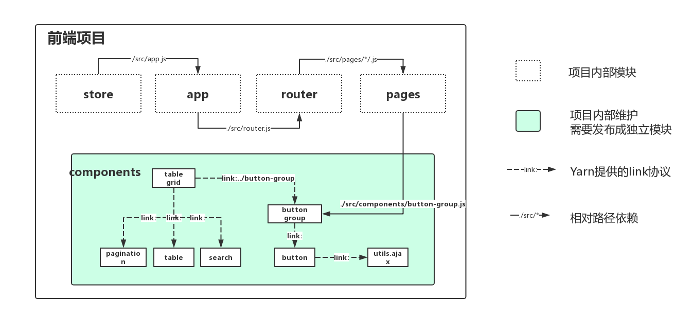

<p align="center">
  
</p>

<p align="center">
  A tool for debug and publish UI components.
</p>

* [About](#about)
* [Getting Started](#getting-started)
* Commands
  - [`storybook`](./src/commands/storybook#readme)
  - [`publish`](./src/commands/publish#readme)
  - [`build`](./src/commands/build#readme)
* [How It Works](#how-it-works)
* [Used With Yarn](#used-with-yarn)
* [Dependencies](#dependencies)
* [Developers](#developers)
* [License](#license)

## About

在前端开发领域，业务开发普遍组件化。这种模式下，对源码的维护就有很大的挑战。目前有两种维护方式 [MONO](https://zhuanlan.zhihu.com/p/31289463) 与 [MULTI](https://zhuanlan.zhihu.com/p/31289463)。在维护大量组件时，使用MONO既可以保证组件的独立性，又可以减少维护成本。

目前针对于MONO已经有了不少的管理工具，[Lerna](https://github.com/lerna/lerna) 是一个不错的管理工具。但，对于前端组件开发领域，Lerna的配置和使用有些繁琐，也不利于集成进自己 [CI](https://github.com/knight-org/knight-shield/blob/master/demo/jenkins-pipeline) 任务中，为了在 **开发** 和 **集成** 时中更方便的管理组件 `knight-shield` 便由此产生

## Getting Started

### Installing
```sh
$ npm install @beisen/storybook-lib --save-dev
```
### Usage
```sh
$ npx sbl storybook start # 组件调试
```
```sh
$ npx sbl publish npm # 发布组件
```
```sh
$ npx sbl buil lib # 编译lib
```

## How it Works
`knight-shield`提供了三大块功能：

[ 录屏展示 ]

## Used With Yarn
使用 `sbl storybook` 功能可以很方便的调试组件。但，在某些场景下往往需要和项目中其他的代码进行联合调试。在这种场景下可以结合 `yarn`，使用其提供的 [workspaces](https://yarnpkg.com/blog/2017/08/02/introducing-workspaces/) 功能，项目结构如下：



在 components/ 中的组件都是MONO的维护方式，是独立的模块。在复杂项目中可能会存在MONO中模块互相依赖的情况，使用yarn的 `link:` 协议创建依赖，如图：

## Dependencies
[Storybook](https://github.com/storybooks/storybook) 和 [Learn](https://github.com/lerna/lerna) 已助实现了部分功能。基于Storybook之上封装了一系列配件和功能实现了**调试功能**。基于了Lerna的内部模块(*@lerna/package, @lerna/package-graph, @lerna/output*)实现了**组件发布功能**

<p align="left">
  
  
</p>

## Developers
<p align="left">
  <a href="https://github.com/zygeilit">
    
  </a>
  <a href="https://github.com/holly-juan">
    
  </a>
  <a href="https://github.com/yuebansangeng">
    
  </a>
</p>

## License

[MIT](https://github.com/storybooks/storybook/blob/master/LICENSE)

